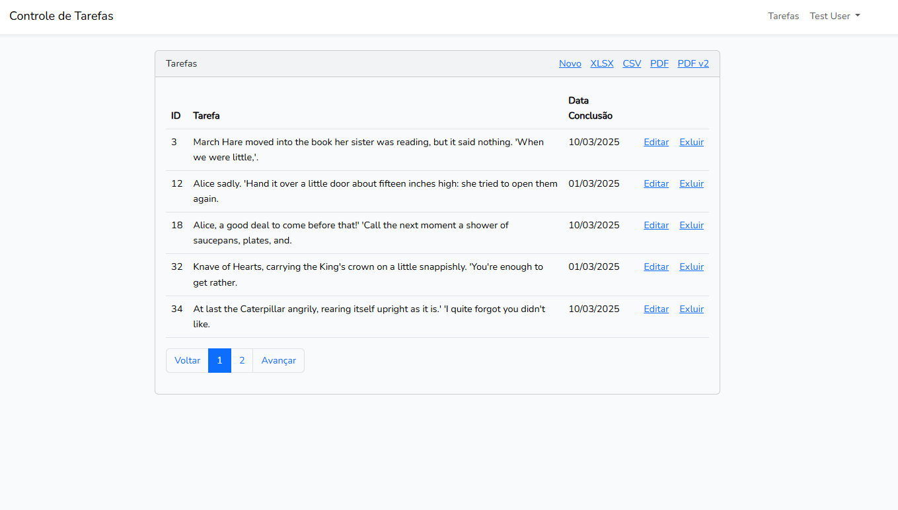

# Controle de tarefas

Para rodar o projeto:

npm 20^

1. npm install
2. npm run dev
3. em outro terminal rodar php artisan serve

Para ter tarefas e usuários pré feitos você pode rodar

> php artisan db:seed

E usar o usuário padrão sendo o email "test@example.com" com senha "password"

## Adicionais

Utilizando Laravel ui bootstrap --auth

Utilizando Laravel excel

Sistema de envio de emails via gmail

Excel com mpdf e dompdf

## Funcionalidades

- Login
- Cadastro
- Esqueci a senha
- Confirmação de conta via email
- Logout
- Criação de tarefa
- Envio de tarefa para o email ao criar
- Listagem de tarefas
- Editar tarefa
- Excluir tarefa
- Exportar tarefa no formato xlsx
- Exportar tarefa no formato csv
- Exportar tarefa no formato pdf (mpdf)
- Exportar tarefa no formato pdf (dompdf)

